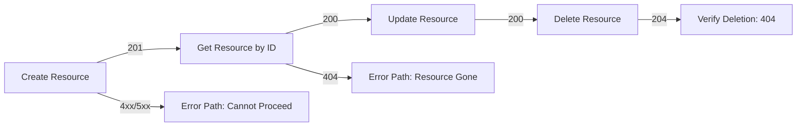

# API Test Generator

A skill for systematically generating comprehensive API test scenarios and executable test scripts from API documentation.

## Workflow Overview

This skill guides you through three structured steps:

```
Step 1: Collect API Documentation
    ↓
Step 2: Generate Test Scenario Matrix + Flowchart → Markdown Output
    ↓
Step 3: Implement Test Scripts (Real Service, No Mock)
```

---

## Step 1: Collect API Documentation

### Ask the user for input

Present this question to the user:

> **Please provide your API documentation:**
>
> Choose one of the following options:
> - **Option A**: Provide the file path to a markdown file containing API documentation
> - **Option B**: Paste the API documentation content directly here

Wait for the user's response before proceeding.

### Parse the documentation

Once you receive the API documentation, extract and organize:

1. **Endpoints**: List all API endpoints with their HTTP methods
2. **Parameters**: For each endpoint, identify:
   - Required parameters (path, query, body)
   - Optional parameters with default values
   - Parameter types and constraints
3. **Response codes**: Document all possible response codes and their meanings
4. **Dependencies**: Note any inter-endpoint dependencies (e.g., create → read → delete sequences)
5. **Authentication**: Identify auth requirements if specified

---

## Step 2: Generate Test Scenario Matrix

### Comprehensive test coverage

For each endpoint, generate test scenarios covering these dimensions:

| Dimension | Cases to Cover |
|-----------|----------------|
| **Error codes** | All documented error codes (400, 401, 403, 404, 500, etc.) |
| **Required params** | Present with valid values, Present with invalid values, Missing entirely |
| **Optional params** | Present with valid values, Present with invalid values, Omitted (use default), Explicit default value |
| **Param values** | Valid reference values, Invalid values (wrong type, out of range, empty, null) |
| **Edge cases** | Boundary values, Unicode/special characters, Large payloads, Empty collections |

### Test scenario matrix template

Generate a table for each endpoint:

```markdown
## Endpoint: {METHOD} {PATH}

### Scenario Matrix

| Scenario ID | Test Case | Parameters | Expected Status | Notes |
|-------------|-----------|------------|-----------------|-------|
| TC001 | Valid request with all params | All required + optional | 200 | Baseline success |
| TC002 | Valid request, minimal params | Only required params | 200 | Minimal valid input |
| TC003 | Missing required param {name} | Omit {param} | 400/4xx | Required field validation |
| TC004 | Invalid type for {param} | {param}=wrong_type | 400 | Type validation |
| TC005 | Out-of-range {param} | {param}=extreme_value | 400 | Range validation |
| TC006 | Empty value for {param} | {param}="" | 400/4xx | Empty string handling |
| TC007 | Auth missing | No auth header | 401 | Authentication required |
| TC008 | Auth invalid | Bad token | 401/403 | Token validation |
| TC009 | Not found | Valid request, nonexistent resource | 404 | Resource existence |
| TC010 | Server error trigger | Condition for 500 | 500 | Error handling |
| ... | ... | ... | ... | ... |
```

### Generate flowcharts

For each endpoint, create a flowchart showing the decision tree of test scenarios:

```mermaid
flowchart TD
    A[Start: Request to {ENDPOINT}] --> B{Auth Present?}
    B -->|No| C[TC007: 401 Unauthorized]
    B -->|Yes| D{Auth Valid?}
    D -->|No| E[TC008: 401/403 Invalid Auth]
    D -->|Yes| F{All Required Params?}
    F -->|No| G[TC003: 400 Missing Param]
    F -->|Yes| H{Param Types Valid?}
    H -->|No| I[TC004: 400 Invalid Type]
    H -->|Yes| J{Values Within Range?}
    J -->|No| K[TC005: 400 Out of Range]
    J -->|Yes| L{Resource Exists?}
    L -->|No| M[TC009: 404 Not Found]
    L -->|Yes| N[TC001/TC002: 200 Success]
    N --> O{Optional Params?}
    O -->|With Optional| P[TC001: Full Response]
    O -->|Without Optional| Q[TC002: Minimal Response]
```

For multi-endpoint workflows, create sequence flowcharts:



### Output to markdown file

Write the complete test scenario documentation to a file:

- **File location**: Same directory as the original API doc, or user-specified location
- **Filename**: `{api-name}-test-scenarios.md`
- **Content structure**:
  1. Overview and endpoint summary
  2. Test scenario matrices for each endpoint
  3. Flowcharts for each endpoint
  4. Multi-endpoint workflow sequences
  5. Test execution priority (critical path → edge cases)

Ask the user: "Where should I save the test scenario documentation? (Default: current directory as `api-test-scenarios.md`)"

---

## Step 3: Implement Test Scripts

### Principles

- **Real service testing**: Connect to actual API endpoints, not mocked responses
- **Configurable base URL**: Allow user to specify the service endpoint
- **Authentication handling**: Support the auth mechanism from documentation
- **Test isolation**: Each test case should be independent and repeatable

### Script structure

Generate test scripts following this structure:

```
tests/
├── config.py          # Base URL, auth config, environment settings
├── test_{endpoint1}.py    # Tests for endpoint 1
├── test_{endpoint2}.py    # Tests for endpoint 2
├── conftest.py        # Shared fixtures (auth setup, cleanup)
├── utils/
│   ├── request_helper.py  # Request wrapper with logging
│   └── data_generator.py  # Test data generators
└── requirements.txt   # Dependencies (requests, pytest, etc.)
```

### Test script template

For each endpoint, generate tests corresponding to the scenario matrix:

```python
# test_{endpoint}.py

import pytest
import requests
from config import BASE_URL, AUTH_TOKEN
from utils.request_helper import make_request

class Test{EndpointName}:

    @pytest.mark.smoke
    def test_tc001_valid_full_params(self):
        """TC001: Valid request with all parameters"""
        response = make_request(
            method="{METHOD}",
            url=f"{BASE_URL}{PATH}",
            params={valid_params},
            headers={"Authorization": f"Bearer {AUTH_TOKEN}"}
        )
        assert response.status_code == 200
        # Additional assertions on response structure

    @pytest.mark.validation
    def test_tc003_missing_required_param(self):
        """TC003: Missing required parameter {param_name}"""
        response = make_request(
            method="{METHOD}",
            url=f"{BASE_URL}{PATH}",
            params={params_without_required},
            headers={"Authorization": f"Bearer {AUTH_TOKEN}"}
        )
        assert response.status_code == 400
        assert "error" in response.json()

    @pytest.mark.auth
    def test_tc007_auth_missing(self):
        """TC007: Authentication missing"""
        response = make_request(
            method="{METHOD}",
            url=f"{BASE_URL}{PATH}",
            params={valid_params}
            # No auth header
        )
        assert response.status_code == 401

    # ... more test methods for each scenario
```

### Configuration template

```python
# config.py

import os

BASE_URL = os.environ.get("API_BASE_URL", "http://localhost:8080")
AUTH_TOKEN = os.environ.get("API_AUTH_TOKEN", "")
TIMEOUT = int(os.environ.get("API_TIMEOUT", "30"))
```

### Ask the user for implementation preferences

Before generating scripts, ask:

> **Test script configuration:**
>
> 1. What is the base URL for the real API service?
> 2. What authentication mechanism should the tests use?
>    - Bearer token (provide token or env var name)
>    - Basic auth (username/password)
>    - API key (header or query param)
>    - OAuth flow
> 3. What test framework do you prefer? (pytest recommended, or unittest, etc.)
> 4. Where should the test scripts be saved?

---

## Summary

The skill outputs:

1. **Step 2 output**: `{api-name}-test-scenarios.md` — Comprehensive test documentation with matrices and flowcharts
2. **Step 3 output**: `tests/` directory — Executable test scripts ready to run against real services

After generating scripts, verify by running:

```bash
pytest tests/ -v --tb=short
```

Report results to the user with pass/fail summary and any failures requiring investigation.